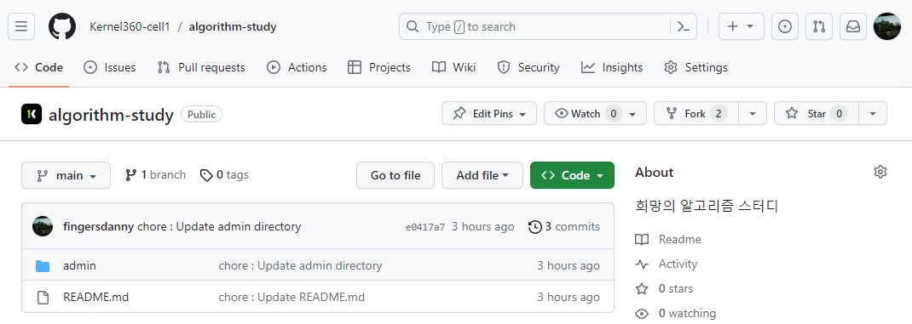
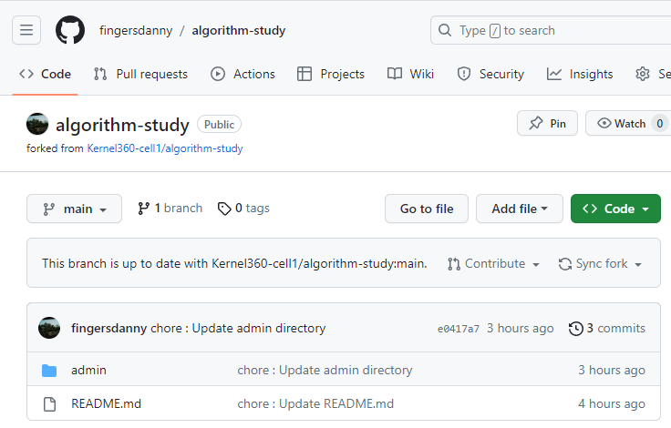
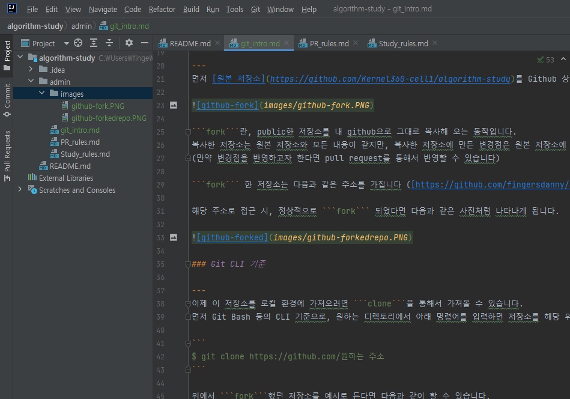
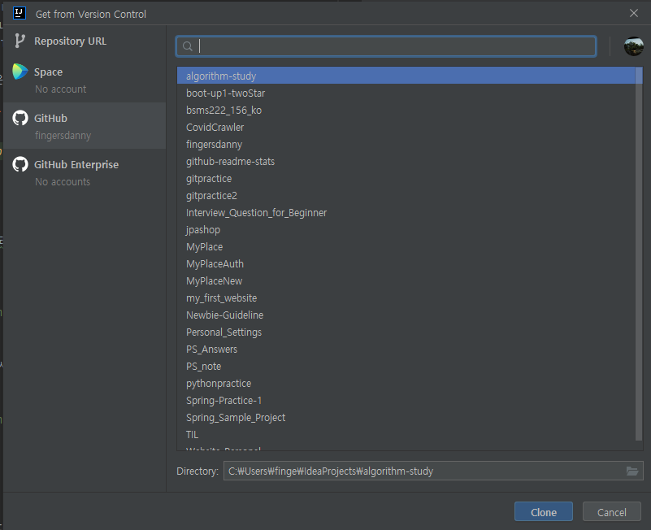
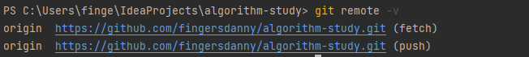
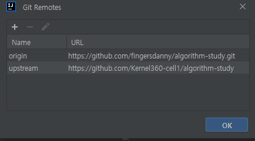
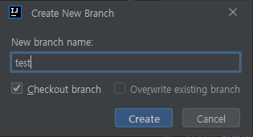

# Git 사용 방법
___
본 스터디를 위한 Git 사용방법입니다.   
Git에 대해서 더 자세히 알고 싶으시면 [여기](https://www.opentutorials.org/course/2708)를 통해 확인해주세요!  
아래에서는 Git CLI 및 IntelliJ를 기준으로 설명합니다.

## 목차
___
* [저장소 fork 및 로컬 환경에 clone 하기](#저장소-fork-및-로컬-환경에-clone-하기)
  * [Git CLI 기준](#git-cli-기준)
  * [IntelliJ 기준](#intellij-기준)
* 원격 저장소 설정
* pull request용 branch 생성
* 코드 수정 및 pull request 보내기
* pull request 승인 이후 branch 삭제
* fork한 저장소 내용 최신으로 유지

## 저장소 fork 및 로컬 환경에 clone 하기

---
먼저 [원본 저장소](https://github.com/Kernel360-cell1/algorithm-study)를 Github 상에서 ```fork``` 해주세요.  



```fork```란, public한 저장소를 내 github으로 그대로 복사해 오는 동작입니다.  
복사한 저장소는 원본 저장소와 모든 내용이 같지만, 복사한 저장소에 만든 변경점은 원본 저장소에 반영되지 않습니다.  
(만약 변경점을 반영하고자 한다면 pull request를 통해서 반영할 수 있습니다)  

```fork``` 한 저장소는 다음과 같은 주소를 가집니다 ([https://github.com/fingersdanny/algorithm-study](https://github.com/fingersdanny/algorithm-study))

해당 주소로 접근 시, 정상적으로 ```fork``` 되었다면 다음과 같은 사진처럼 나타나게 됩니다.
 


### Git CLI 기준

---
이제 이 저장소를 로컬 환경에 가져오려면 ```clone```을 통해서 가져올 수 있습니다.  
먼저 Git Bash 등의 CLI 기준으로, 원하는 디렉토리에서 아래 명령어를 입력하면 저장소를 해당 위치로 ```clone```할 수 있습니다. 

```
$ git clone https://github.com/원하는 주소 
```

위에서 ```fork```했던 저장소를 예시로 든다면 다음과 같이 할 수 있습니다.

```
$ git clone https://github.com/fingersdanny/algorithm-study
```

### IntelliJ 기준

---
IntelliJ등의 IDE에서는 본인의 Github 계정과 연동할 수 있는 기능을 이미 제공하고 있습니다.  
IntelliJ에서는 다음과 같은 방법으로 본인의 저장소를 로컬환경을 가져올 수 있습니다.

상단의 ```Git```에서 ```Clone```을 클릭




Get from Version Control에서 원하는 저장소를 선택후 Clone 하면 저장소가 로컬 환경으로 복사됩니다.




## 원격 저장소 설정

---

터미널이나 Git Bash에서 아래 명령어를 입력해보면, clone한 저장소에 연결된 원격 저장소의 주소가 나타납니다.

```
git remote -v
```



현재 로컬 환경에서는 ``fork``해둔 저장소에만 연결이 되어 있습니다. 하지만 우리가 문제를 푼 내용을 원본 저장소에 pull request를 통해 반영하려면, 해당 저장소의 주소 정보를 가지고 있어야 합니다.   


따라서 다음과 같은 방법으로 원본 저장소를 로컬 환경에 추가할 수 있습니다.


### Git CLI

---
아래의 명령어로 원본 저장소의 주소를 추가할 수 있습니다.
```
$ git remote add [name] [address]
```

저장소의 이름을 upstream으로 한다면, 아래와 같이 할 수 있습니다.

```
$ git remote add upstream https://github.com/Kernel360-cell1/algorithm-study
```

### IntelliJ

---

IntelliJ에서는 다음과 같이할 수 있습니다. 

상단의 ```Git```에서 ```Manage remotes```를 클릭


다음과 같은 창이 뜨면 좌측 상단의 ```+```를 통해서 새로운 remote를 추가할 수 있습니다.



## pull request용 branch 생성

---

``branch``란, Git에서 생기는 갈래길을 의미합니다.
main branch는 보통의 저장소의 기본 내용을 담고 있으며, 여기에는 바로 수정사항을 적용하지 않습니다.  
branch를 생성하고, branch 내에서 원하는 만큼 변경 사항을 만든 후, pull request을 보내게 됩니다.

새 branch는 아래 명령어로 만들 수 있습니다.

```
$ git checkout -b [branchName]
```

위 명령어를 통해 ``branchName``이라는 branch가 새로 생성되며, 현재 위치하고 있는 branch 역시 새로 만든 branch로 이동합니다.

IntelliJ를 이용한다면 앞서 과정들과 마찬가지로 상단의 ``Git`` - ``New Branch``를 통해서 새로운 브랜치를 만들고 체크아웃까지 바로 할 수 있습니다.  




## 코드 수정 및 pull request 보내기

---
새로 생성한 branch에서 내용을 추가 및 수정하고 이후 해당 내용을 원격 저장소에 pull request(이하 PR)을 보내기 위해서는 아래 과정을 거칩니다.

### Git CLI

---
```
$ git add [commit을 통해 변경, 추가할 내용]
```

변경된 점은 ``git status`` 명령어로 확인할 수 있고 그 중 일부를 지정하여 추가하거나, ``git add .`` 명령어를 이용해 변경사항 전체를 추가할 수 있습니다.  
다음으로, 변경점을 commit합니다.

```
$ git commit -m "commit message"
```

위 명령어를 통해 커밋 메세지를 적고, 커밋할 수 있습니다.
또는 ``git commit``까지만 입력하면, vim 편집기로 커밋 메세지를 구체적으로 작성할 수도 있습니다.

커밋까지 마쳤다면, PR을 보낼 수 있습니다.

위에서 설정한 예시대로라면 아래와 같이 pr을 보낼 수 있습니다.
```
$ git push origin test
```
요청한 PR은 아래와 같이 요청을 마무리 해야 합니다.  
GitHub에서 `fork`한 저장소에 접속하면, PR 버튼이 활성화 됩니다.  
클릭하고, 필요한 경우 추가 설명을 작성한 후 Send Pull Request를 클릭하면, PR이 마무리 됩니다.

### IntelliJ

---

마찬 가지로 ``Git`` - ``Commit``을 통해서 Commit할 내용을 선택할 수 있고 메세지를 작성할 수 있습니다.


## PR 승인 이후 branch 삭제

---

PR이 승인 되었다면, local과 remote 환경에서의 branch를 삭제해 줍시다.  
먼저 main branch로 돌아옵니다.

```
$ git checkout main
```

다음으로, 아래 명령어를 차례로 입력합니다.

```
$ git branch -D [branchName]
$ git push origin --delete [branchName]
```

첫 줄은 local, 두 번째 줄은 remote branch를 각각 삭제합니다.

## Fork한 저장소 내용 최신으로 유지

---

앞의 과정까지 마무리하였다면, 새로 개발한 내용이 원격 원본 저장소에 반영이 되었고, 로컬 환경에서 개발을 위한 branch는 제거하였습니다.  
마지막으로 남은 과정이 fork한 저장소의 내용을 원본 저장소와 똑같이 맞추는 것입니다.

```
$ git fetch upstream
$ git merge upstream/main
$ git push
```

위 명령어를 차례로 입력합니다.  
원본 저장소 (upstream)의 내용을 받아 와서, fork한 저장소와 합치고, 해당 내용을 push하게 됩니다.
